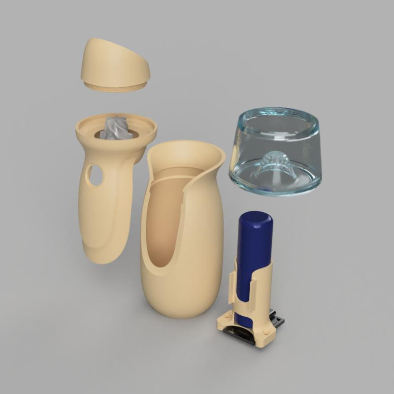

# Aspirateur Miniature

## Projet Personnel

Dans le cadre d'un projet personnel, j'ai conçu et réalisé un aspirateur miniaturisé combinant modélisation / impression 3D, électronique embarquée et gestion d'un moteur brushless.

## Étapes Clés du Projet

### Modélisation 3D

Conception du boîtier et de la turbine à l'aide de logiciels de CAO, optimisés pour une impression 3D (Fusion360) dans l'optique d'une ergonomie adaptée et d'une taille minimale contenant l'électronique.

### Fabrication

Impression 3D des composants structurels et de la turbine, avec ajustements itératifs pour maximiser l'efficacité d'aspiration.

### Électronique sur Mesure

Gestion de la batterie et de sa recharge, alimentation du micro-contrôleur et moteur brushless via boost converter.
