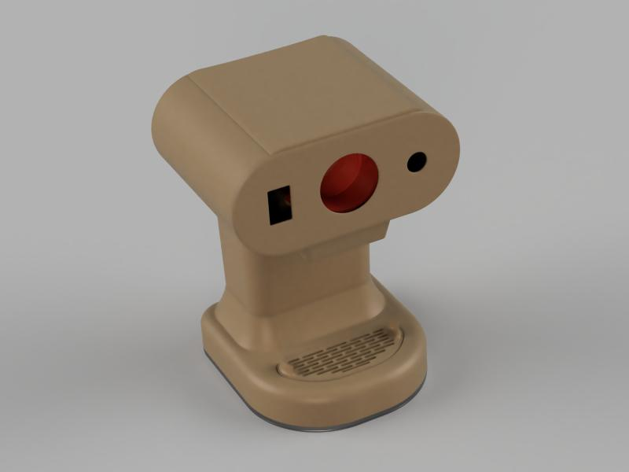
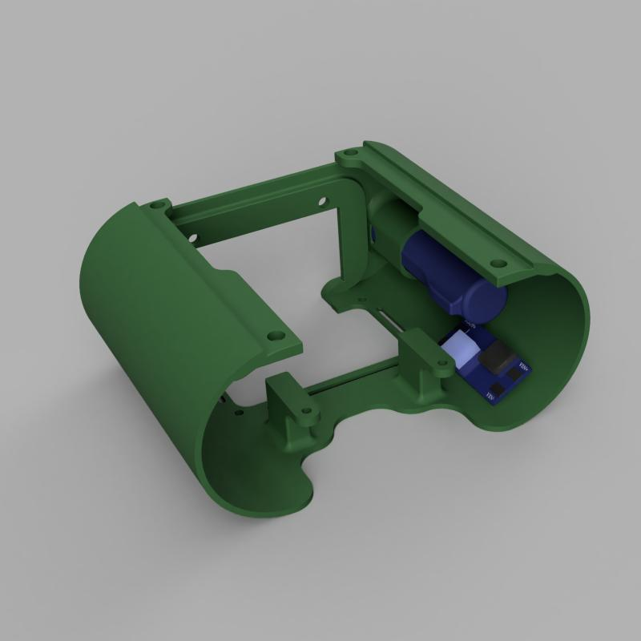

# Distributeur d'Engrais Automatique

## Besoin

Arrosage manuel d'un grand nombre de plantes nécessitant un dosage précis en nutriments.

## Objectif

Automatiser une tâche répétitive avec un dosage reproductible et fiable.

## Projet Personnel

Conception d'un système embarqué destiné à l'automatisation de l'arrosage de plantes avec dosage précis et reproductible.

### Caractéristiques techniques

- **Microcontrôleur** : ESP32
- **Communication** : Dosage programmable via Wi-Fi
- **Actionneur** : Pilotage d'une pompe péristaltique
- **Électronique** : Sur mesure
- **Mécanique** : Conception complète (modélisation et impression 3D)
